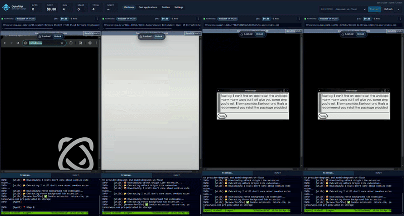
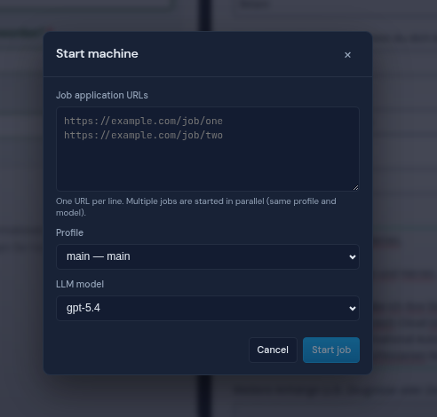
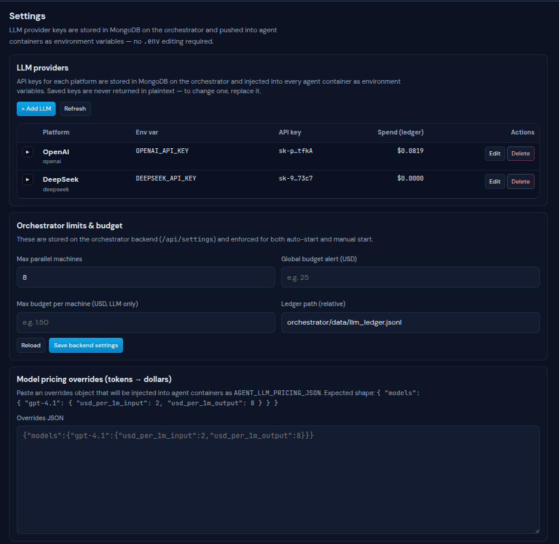

<p align="center">
  
</p>

<h1 align="center">OctoPilot</h1>

<p align="center"><strong>Agentic AI web task orchestration — run a fleet of autonomous browser agents in parallel, with a human always one click away.</strong></p>

OctoPilot spins up isolated, disposable Dockerized agents that drive real Chromium browsers to complete web tasks on your behalf. Each agent is a full Linux desktop you can *watch live* in the browser, *pause* mid-thought, or *take over* when the LLM gets stuck. Dispatch dozens of agents from a single dashboard, share structured profiles between them, and keep a running ledger of LLM spend — all from one place.


*The main dashboard: several agent "machines" running in parallel, each tile embeds a live noVNC view of the agent's desktop and a web terminal. The left sidebar shows aggregate health, budget, and a "Start job" launcher.*

---

## Table of contents

- [What it is](#what-it-is)
- [Use cases](#use-cases)
- [Key features](#key-features)
- [Architecture](#architecture)
- [Requirements](#requirements)
- [Setup](#setup)
- [Starting your first agent](#starting-your-first-agent)
- [Human-in-the-loop controls](#human-in-the-loop-controls)
- [Configuration reference](#configuration-reference)
- [Repository layout](#repository-layout)

---

## What it is

OctoPilot is a **web task orchestrator** for LLM-driven browser agents. You give it:

1. A **starting URL** (a form, a search page, a portal, a dashboard — anything on the open web).
2. A **profile** (structured data the agent can pull from when the page asks for it — name, preferences, a resume, custom fields).
3. A **model** (any supported LLM — OpenAI ChatGPT, DeepSeek, …).

OctoPilot then launches a throwaway container running a real desktop browser, hands the task to the agent, and streams the desktop back to you in real time. You can watch it think, interrupt it at any LLM step, or walk up to the keyboard and finish the job yourself.

The tool is designed for work that is:

- **Repetitive but not scriptable** (every form is shaped slightly differently).
- **High-volume** (you want 10 running at once, not one-at-a-time).
- **Partially autonomous** (you want the agent to handle the boring 90% and ask you when it's unsure).

## Use cases

OctoPilot ships with a reference workflow for **job applications** (PDF resume → structured profile → agents that apply in parallel), but the same primitives fit a wide range of web work:

- **Bulk form filling** — apply to jobs, submit grant applications, register accounts, request quotes.
- **Portal automation** — government portals, expense systems, legacy SaaS, supplier onboarding.
- **Lead-gen and outreach** — scrape a directory page by page, personalize a message, send.
- **Research agents** — spin up N agents on N queries and compare screenshots / results.
- **Regression-style exploration** — "log in, click around, tell me what's broken".
- **Any long-tail workflow** that needs a real headed browser and a human referee.

## Key features

### Parallel agent fleet

Start as many agents as your `max_parallel_machines` budget allows. Each runs in its own Docker container with its own Chromium, its own Xvfb display, its own filesystem, and its own control plane. The dashboard polls every two seconds and reflects per-agent status, token usage, cost, and current URL.


*The "Start Job" launcher: pick a starting URL, choose a profile from the dropdown (resumes imported via PDF appear here), and pick an LLM model (OpenAI ChatGPT, DeepSeek, …). The sidebar also shows aggregate stats and the global parallel-machine limit.*

### Live view + web terminal, per agent

Every machine card embeds:

- **noVNC** (port 6080 inside the container) — the agent's full desktop, rendered straight into an iframe. You see exactly what the LLM sees.
- **ttyd** (port 7681 inside the container) — a web terminal attached to the agent process so you can `tail` logs, poke around, or attach `tmux`.

Both are themed to match the orchestrator UI (dark scrollbars, matching fonts) and resize with the card.


*A single machine card in focus: live Chromium desktop (top), attached web terminal (bottom), and the control strip showing Pause, Takeover, Restart, Stop, and the per-run token / cost counters.*

### Human-in-the-loop controls

Every agent exposes a **cooperative control file** watched by the Python process (`agent/agent_control.py`). The orchestrator writes one of three states and the agent reads it *right before the next LLM call*:

- **Running** — normal operation.
- **Paused** — the agent blocks before the next LLM request. Resume at will.
- **Stopping (takeover)** — the agent exits cleanly so *you* can drive the desktop. No race, no zombie LLM call, no charges for work nobody wanted.

When an agent can't make progress on its own (out of funds, hit a CAPTCHA, ambiguous form field), it sets a `needs_human` flag. The orchestrator surfaces it as:

- A visual outline on the machine card.
- A looping alert sound (`urgent.wav` for per-machine budget issues, `bipbop.wav` for general attention).
- A top-of-page banner when the browser blocks the sound until the user interacts.

*An agent has paused itself for human input. The tile is outlined in amber, the side panel shows the reason ("form field ambiguous"), and the "Takeover" button hands the desktop to the user.*

### Profiles — structured data the agents share

Import a PDF (typically a resume), and OctoPilot runs it through an LLM to produce a structured **Profile** that matches a master schema (`master_profile_schema.json`). Agents use this profile to answer form questions. Profiles have:

- Absolute fields (name, email, address…).
- Relative fields (salary expectation, start date, work authorization for *this* role).
- Custom fields the agent can add on the fly when it hits an unrecognized question — you review and approve them later.
- **Attachments** — per-profile documents (resumes, cover letters, transcripts…) uploaded straight from the Profiles page. Each file is stored under `attachments/<profile_id>/` and recorded inside the profile JSON as a `{ display_name: relative_path }` map. The agent container bind-mounts `attachments/` read-only and exposes every file in the profile's `attachments` group as an available file to the LLM.


*The Profiles page: left — list of stored profiles with PDF import button; right — the structured field editor with absolute vs relative categories, custom fields added by agents highlighted for review.*

### LLM ledger and budget guardrails

Every agent reports token usage to the orchestrator as it runs. The ledger page shows:

- Per-run cost (computed from `agent/pricing.json`).
- Global and per-machine budgets.
- An **OpenAI reconciliation** button that pulls the actual billing numbers from OpenAI's API and diffs them against OctoPilot's estimates.

When a machine exceeds its budget or the provider returns "insufficient quota", the agent pauses itself and the dashboard flags it for your attention.

### Settings — everything you'd expect

- Default LLM model for queued jobs.
- Max parallel machines (live-editable; takes effect immediately).
- Global budget ceiling.
- Per-machine budget ceiling.
- LLM provider keys per platform (OpenAI, DeepSeek, Anthropic, Google, Browser-Use…) — added directly from the **LLM providers** table in Settings, stored in MongoDB and pushed into agent containers as environment variables on every spawn / restart. No `.env` editing required.
- Master schema editor (add fields, rename labels, tune descriptions the agents read).


*The Settings page: the LLM providers table (one row per platform, masked API key, expandable per-model pricing, and total spend pulled from the ledger), default model, parallel-machine cap, per-run and global budgets, and the master schema editor for tuning the profile fields agents read.*

### Applications tracker

When an agent finishes a task it can post a structured result. The **Applications** page shows a sortable table of everything submitted so far, with screenshots, the profile used, cost, and status.

*The Applications tracker: each row is one completed task, with the target URL, profile used, final screenshot, token cost, and a "View run" link that restores the screenshot carousel for that agent.*

### Screenshot carousel per run

Every agent stores a screenshot at each turn. The carousel on each card lets you scrub back through the agent's reasoning without replaying the whole session.

## Architecture

```
                     ┌─────────────────────────────────┐
                     │        Orchestrator UI          │   React + Vite
                     │   (http://localhost:5080)       │   served by nginx
                     └──────────────┬──────────────────┘
                                    │ REST /api/*
                                    ▼
                     ┌─────────────────────────────────┐
                     │     Orchestrator Backend        │   Flask
                     │   (http://localhost:5050)       │   talks to docker.sock
                     └──────┬────────────────┬─────────┘
                            │                │
                    docker run …       MongoDB (profiles, ledger, runs)
                            │
                            ▼
     ┌──────────────────────────────────────────────────┐
     │              Agent container (per job)           │
     │  ┌───────────┐  ┌───────────┐  ┌──────────────┐  │
     │  │ Chromium  │  │ browser-  │  │   LLM        │  │
     │  │  + Xvfb   │◄─┤ use agent ├─►│  (OpenAI)    │  │
     │  └─────┬─────┘  └─────▲─────┘  └──────────────┘  │
     │        │              │                          │
     │     noVNC:6080     ttyd:7681    control file     │
     └────────┼──────────────┼───────────▲──────────────┘
              │              │           │
              └──────────────┴───────────┘
                 embedded live in the UI tile
```

- **Orchestrator backend** (`orchestrator/backend/app.py`) is a Flask service that launches agent containers over the Docker socket, persists profiles and ledger data in MongoDB, and exposes the REST API the React UI consumes.
- **Orchestrator frontend** (`orchestrator/frontend/`) is a React + Vite SPA served by nginx.
- **Agent** (`agent/`) is a Python entrypoint that runs a `browser-use` agent against a headed Chromium inside Xvfb, exposing noVNC and ttyd for the UI to embed. Control flow is gated by a cooperative control file the orchestrator writes.
- **MongoDB** stores profiles, ledger entries, run metadata, and settings.

## Requirements

- **Linux** host (tested on Ubuntu 24.04 / kernel 6.x). macOS and Windows should work via Docker Desktop but are untested by the maintainers.
- **Docker Engine** with the Compose plugin (`docker compose version` must succeed).
- **~8 GB RAM** free when running 3–4 agents in parallel; each agent container is a full Chromium + Xvfb desktop.
- **An LLM API key** — OpenAI, DeepSeek, or any other provider supported by `browser-use` / LangChain. The provider used is selected per agent at start time.
- **Ports free on the host**: `5050` (orchestrator API), `5080` (orchestrator UI), `27017` (MongoDB). Agent containers expose `6080` / `7681` internally; the orchestrator brokers them.
- Python **3.12+** is only needed if you plan to run `manage_profiles.py` from the host. Everything else runs inside containers.

## Setup

### 1. Clone

```bash
git clone <your-fork> octopilot
cd octopilot
```

### 2. Point docker-compose at your repo root

`docker-compose.yml` has one host-specific line that tells the orchestrator where this repo lives *on the host* (it needs this to bind-mount files into agent containers):

```yaml
ORCH_HOST_REPO_ROOT: "/absolute/path/to/octopilot"
```

Change it to match `pwd`.

### 3. Configure your LLM credentials

Once the stack is running you add provider keys from the **Settings → LLM providers** table in the UI. They're stored in MongoDB on the orchestrator and injected as environment variables (`OPENAI_API_KEY`, `DEEPSEEK_API_KEY`, `ANTHROPIC_API_KEY`, `GOOGLE_API_KEY`, `BROWSER_USE_API_KEY`, …) into every agent container at spawn / restart time. Saved keys are never returned to the browser in plaintext — only as a masked preview; to change one, replace it.

The orchestrator picks the provider for each run from the chosen model id — `deepseek-*` ids dispatch to DeepSeek's OpenAI-compatible API (`https://api.deepseek.com/v1`), `gpt-*` / `o1`-`o4` / `chatgpt-*` ids dispatch to OpenAI, etc. Prefer **`deepseek-v4-flash`** (V4-Flash) or **`deepseek-v4-pro`** for new work; older `deepseek-chat` / `deepseek-reasoner` names are legacy compatibility aliases. So as long as the matching API key is stored in **Settings → LLM providers**, switching models is a one-click change with no `.env` editing.

Optional overrides for orchestrator-side tooling (PDF profile import, etc.) can still go in a `.env` at the repo root:

```dotenv
PROFILE_LLM_MODEL=gpt-4o-mini
AGENT_LLM_PRICING_FILE=/repo/agent/pricing.json
```

### 4. Build the agent image

The orchestrator starts each job by `docker run`-ing the `octopilot-agent:latest` image, so you have to build it once (and again whenever you change `agent/`):

```bash
./build_agent_image.sh
```

This builds from `agent/Dockerfile`, tags the result as `octopilot-agent:<next-version>` and `octopilot-agent:latest`, and bumps `agent/VERSION`.

### 5. Start the stack

```bash
./start.sh
```

This runs `docker compose up -d --build` and brings up:

- `octopilot-master-database` (MongoDB)
- `octopilot-orchestrator-backend` (Flask API on `:5050`)
- `octopilot-orchestrator-frontend` (nginx on `:5080`)

Open **http://localhost:5080/** and you should see the dashboard.

### 6. Stopping

```bash
./stop.sh          # stop containers, keep volumes
./stop.sh --down   # also wipe volumes (profiles, ledger, runs)
```

## Starting your first agent

1. Open the dashboard at `http://localhost:5080/`.
2. (Optional) Go to **Profiles** and import a PDF — a resume works out of the box — or click **New profile** and fill fields manually.
3. Click **Start job** in the sidebar.
4. Paste a starting URL (e.g. a careers page or a form).
5. Pick a profile and a model.
6. Hit **Start**. A new tile appears in the grid, goes through `starting → running`, and within a few seconds you'll see Chromium launch inside the card.

You can now watch the agent work, pause it, take over, or just leave it running while you queue more.

## Human-in-the-loop controls

The controls on each machine card map to explicit orchestrator endpoints:

| Control | What it does | Under the hood |
| --- | --- | --- |
| **Pause** | Block the agent before its next LLM call. | Writes `state=paused` to the control file; agent blocks in `AgentControl.gate()`. |
| **Resume** | Unblock. | Writes `state=running`. |
| **Takeover** | Stop the agent cleanly so the user can drive the desktop via noVNC. | Writes `state=stopping`; agent raises `TakeoverRequested` (exit code 42). |
| **Restart** | Kill the container and start a fresh agent with the same config. | `POST /api/machines/<id>/restart` |
| **Stop** | Stop the agent but keep the card around. | `DELETE /api/machines/<id>` |
| **Remove** | Stop and delete the card entirely. | `DELETE /api/machines/<id>/remove` |
| **Attention cleared** | Silence alerts after you've handled the issue. | `POST /api/machines/<id>/attention` |

The pause / takeover design is deliberately **cooperative** (not SIGSTOP) — read the docstring in `agent/agent_control.py` for why.

## Configuration reference

All orchestrator settings are environment variables on `orchestrator-backend` in `docker-compose.yml`:

| Var | Default | Meaning |
| --- | --- | --- |
| `ORCH_PORT` | `5050` | Port the Flask backend binds inside the container. |
| `ORCH_PUBLIC_HOST` | `127.0.0.1` | Host the UI uses to build links back to agent noVNC / ttyd. |
| `ORCH_MONGO_URI` | `mongodb://master-database:27017` | MongoDB connection. |
| `ORCH_MONGO_DB_NAME` | `orchestrator_db` | Mongo database name. |
| `ORCH_HOST_REPO_ROOT` | *(required)* | Absolute host path to the repo so the orchestrator can bind-mount code into agents. |
| `ORCH_DOCKER_BIN` | `/host-bin/docker` | Docker CLI the orchestrator uses (mounted from the host). |
| `ORCH_MAX_PARALLEL_MACHINES` | `4` | Global ceiling on concurrent agents. Overridable from the UI at runtime. |
| `SOURCE_API` | *(empty)* | Optional external queue URL the orchestrator will poll for jobs. Leave blank to drive everything from the UI. |

Per-agent env (set in `agent/Dockerfile` or overridden at container-spawn):

| Var | Default | Meaning |
| --- | --- | --- |
| `AGENT_VIEW_WIDTH` / `AGENT_VIEW_HEIGHT` | `1080` / `1920` | Virtual display geometry. Default is portrait for mobile-style layouts. |
| `XVFB_RESOLUTION` | derived from the two above | Override to change color depth or resolution. |
| `AGENT_CONTROL_DIR` | set per-run by orchestrator | Directory containing `state.json` used for pause / takeover. |
| `BROWSER_USE_BROWSER_BINARY` | resolved at entrypoint | Path to Chromium; the entrypoint finds Playwright's bundled Chromium automatically. |

## Repository layout

```
octopilot/
├── agent/                     # The per-job browser agent (Python + browser-use)
│   ├── Dockerfile             # Playwright + Xvfb + noVNC + ttyd
│   ├── cli.py                 # Agent entrypoint (parses config, drives browser-use)
│   ├── agent_control.py       # Cooperative pause / takeover gate
│   ├── llm_usage.py           # Per-run token/cost accounting
│   ├── pricing.json           # Model → $/1K tokens table used by the ledger
│   ├── sanitizing_chat_openai.py
│   └── docker/entrypoint.sh   # Boots Xvfb, noVNC, ttyd, then the agent
│
├── orchestrator/
│   ├── backend/               # Flask API (launches agent containers, serves the UI)
│   │   ├── app.py
│   │   └── Dockerfile
│   └── frontend/              # React + Vite dashboard
│       ├── src/
│       │   ├── App.jsx
│       │   └── components/    # Sidebar, MachineCard, ProfilesPage, …
│       └── Dockerfile
│
├── profiles/                  # Profile model, store, and LLM-powered PDF → profile extractor
│   ├── models.py
│   ├── store.py
│   ├── from_pdf.py
│   ├── llm_profile.py
│   ├── pdf_extract.py
│   └── profiler.py
│
├── master_profile_schema.json # Canonical field catalog agents use when they see a form
├── manage_profiles.py         # CLI for importing / listing / showing profiles (host-side)
├── docker-compose.yml
├── build_agent_image.sh       # Builds + tags octopilot-agent:<version>
├── start.sh / stop.sh         # Compose wrappers
└── requirements.txt           # Host-side deps (only needed for manage_profiles.py)
```

---

**Status:** OctoPilot is an actively evolving prototype. Interfaces — especially the REST API and the profile schema — may change between versions. Pin `agent/VERSION` and the compose file together if you deploy.
